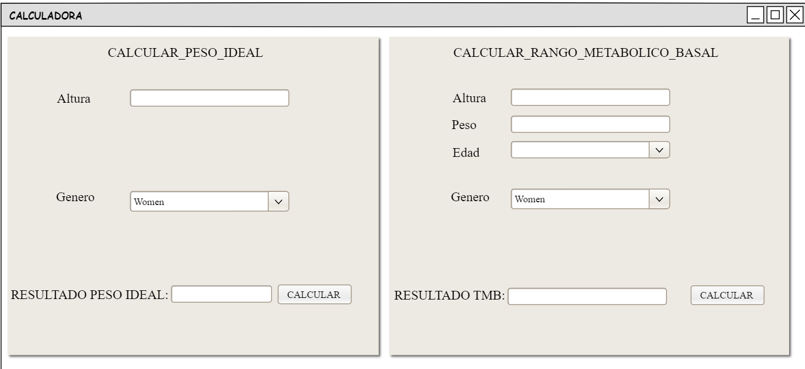
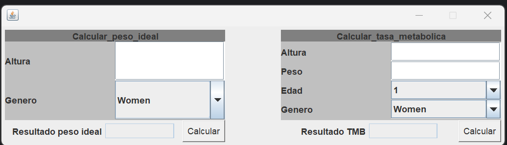

# isa2025-healthcalc
Health calculator used in Ingeniería del Software Avanzada

## Dependencies
--Java

---
Hay que hacer una clase HelathCalcInf
donde implementamos las clases al lado de la interfaz (codigo organizado) y los test se van a hacer en base a esas funciones


Funciones de github que vamos a usar :
```
git status
git add
git commit
git push
git merge
```


## Public float idealWeight funcion
**Entradas:** int height(cm) , char gender y puede lanzar una excepcion.

*Que lance una excepcion si no se han metido cm o gender que no sea 'm o v'* 

**Si el genero es hombre (M)**
>For men: IW = height - 100 - (height - 150) / 4)

**Si el genero es mujer (W)**
>For women: IW = height - 100 - (height - 150) / 25)

Esto devuelve el peso ideal (kg) no hace falta conversiones

## public float basalMetabolicRate
**entrada:** float weight, int height , int age , char gender y lanza un excepcion

*comprobar antes de nada que todos los parametros que se meten son del tipo que queremos*

**Si el genero es hombre (M)**
>For men: BMR = 88.362 + 13.397 * weight + 4.799 * height - 5.677 * age

**Si el genero es mujer (W)**
>For women: BMR = 447.593 + 9.247 * weight + 3.098 * height - 4.330 * age

Esto nos devuelve el BMR de la persona en kcal/day


# CASOS DE PRUEBA 

1. Comprobar si los parametros que se meten corresponden a los que se piden 
2. Comprobar que no sobrepasen los limites
3. comprobar que se hacen bien los calculos
4. Comprobar que se elige entre m o w correctamente y que salga excepcion si se pone otra cosa

## Casos de prueba funcion idealWeight
```
1. Correcta introduccion del genero que solo puede ser 'w' o 'm'.

2. Comprobar que la altura sea entre 140cm y 250cm

3. Comprobar si se calcula correctamente el peso ideal para mujeres

4. Comprobar si se calcula correctamente el peso ideal para hombres

```

## Casos de prueba funcion basalMetabolicRate
```
1. Correcta introduccion del genero que solo puede ser 'w' o 'm'.

2. Comprobar que la altura sea entre 140cm y 250cm

3. Comprobar que la edad introducida esta entre 5 y 100 para que sea valida

4. Comprobar que el peso introducir es valido y esta en el rango de 30kg y 300kg

5. Comprobar si se calcula correctamente el IBM para mujeres

6. Comprobar si se calcula correctamente el IBM para hombres
```

## .gitignore
En el .gitignore se puede observar que se ingnoran los archivos basicos para los proyectos en Java , se adjunta el archivo para facilitar el acceso.
 [.gitignore](./.gitignore).


# PRUEBAS TEST RESULTADOS


Al compilar todos los test mencionados en los casos de prueba se observa que todos funcionan correctamente.


# Práctica 4: Interfaz gráfica de usuario
## Imagen boceto del proyecto

Este boceto se ha hecho con la herramienta Pencil que es un sofware gratuito 

## Imagen resultado del proyecto

No se ha podido recrear de forma perfecta pero al menos se le da dado un estilo bonito y entendible para todo el mundo.


# Informacion adicional
Al principio del repositorio vera dos archivos `.Jar` creado con Maven ademas de en la carpeta `doc` podra ver las fotos y el archivo creado por la herramienta pencil 


# Practica 6: Patrones de diseño

En esta practica nuestro objetivo principal es graficar los diagramas con los diseños que cumplan los requisitos explicados en la practica e implementarlos en nuestro proyecto HealhCalc.

Se usaron los siguientes diseños para llevar a cabo los requisitos de la practica

- `Singleton`: Es el primero que nos piden el cual se encarga de garantizar que cada clase tenga una unica instancia en todo el sistema de la calculadora, para ello da puntos de acesso global para poder acceder a ella.
- `Adapter`: Es un patron que permite que dos interfaces que no son compatibles puedan trabajar , para ello adapta los metodos y datos para que sean compatibles.
- `Proxy`: Es un patron representante el cual controla el acceso a dicho objeto , aqui lo usamos para presentar HealthProxy y ademas usamos la interfaz HealthStats para almacenar datos cuando se utiliza la clase que se protege.
- `Decorator`: Es un patron que permite añadir funciones , en esta cosa lo usamos para Añadir los idiomas Español e Ingles (DecoratorIdiom) y las regiones de EU y USA (DecoratorRegion).

## Singleton
### Diagrama usado

### Explicacion implementacion
En la implementacino de codigo no ha sino necesario crear una clase Singleton sino que ha habido que crear una funcion `getInstance()` en la clase `HealthCalcImpl.java` para que se controle la instancia y el acesso a la variable que en este caso ahora es privada.
### Implementacion main y resultados
En la clase `Main` la unica diferencia que ha habido es la implementacion de la clase **"HealthCalcImpl modelo = HealthCalcImpl.getInstance();"** Por lo que los resultados son los mismo que la practica anterior.


## Adapter
### Diagrama usado

### Explicacion implementacion
Se creo una clase `HealthHospital` que seria la clase que se debe adaptar a la clase `HealthCalc` , para aplicar el adaptador se creo la clase `HealthAdapter.java` el cual modifica los datos introducidos por el HealthHospital (el peso en gramos y la altura metros) para modificarlos y adaptarlos a HealthCalc (el peso en kg y la altura en cm)
### Implementacion main y resultados


## Proxy
### Diagrama usado

### Explicacion implementacion
Para implementar el patron se creo la clase `HealthProxy` que implementa la interfaz `HealthStats` , la clase HealthProxy lo que hara es que por cada llamada a la clase HealthHospital almacenara las metricas mostradas en el diagrama y calculara la media de dichas metricas.
### Implementacion main y resultados


## Decorator
### Diagrama usado

### Explicacion implementacion
Para hacer la implementacion fue necesario crear varias clases, `DecoratorIdiom` el cual es la clase padre de `Ingles.java` y `Espanyol.java` las cuales son las clases hijas que devuelven mensajes en los respectivos idiomas sobre la calculadora. Ademas se implementa `DecoratorRegion` el cual es la clase padre de `EU` y `USA` las cuales corresponden a las regiones donde se usa la calculadora EU(Se introduce en gramos y metros) y la calculadora USA(Que introduce pies y libras ).
### Implementacion main y resultados
