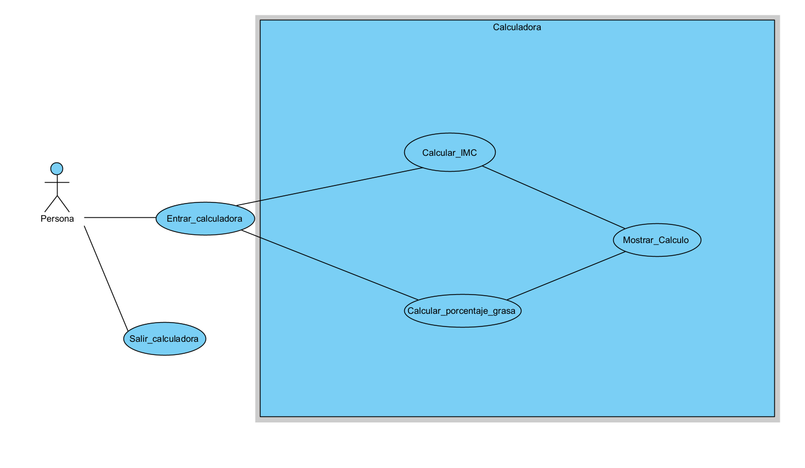

# isa2025-healthcalc
Health calculator used in Ingeniería del Software Avanzada

## Dependencies
--Java

---
Hay que hacer una clase HelathCalcInf
donde implementamos las clases al lado de la interfaz (codigo organizado) y los test se van a hacer en base a esas funciones


Funciones de github que vamos a usar :
```
git status
git add
git commit
```


# Public float idealWeight funcion
entradas: int height(cm) , char gender y puede lanzar una excepcion asi que necesitamos un try catch

Que lance una excepcion si no se han metido cm o gender uqe no sea 'm o v' 

if(char==m)
>For men: IW = height - 100 - (height - 150) / 4)

if(char==women)
>For women: IW = height - 100 - (height - 150) / 25)

Esto devuelve el peso ideal (kg) no hace falta conversiones

# public float basalMetabolicRate
entrada: float weight, int height , int age , char gender y lanza un excepcion

comprobar antes de nada que todos los parametros que se meten son del tipo que queremos

if(char==m)
>FFor men: BMR = 88.362 + 13.397 * weight + 4.799 * height - 5.677 * age

if(char==w)
>For women: BMR = 447.593 + 9.247 * weight + 3.098 * height - 4.330 * age

Esto nos devuelve el BMR de la persona en kcal/day


# CASOS DE PRUEBA GENERALES (concepto)

1. Comprobar si los parametros que se meten corresponden a los que se piden 
2. Comprobar que no sobrepasen los limites
3. comprobar que se hacen bien los calculos
4. Comprobar que se elige entre m o w correctamente y que salga excepcion si se pone otra cosa

# Casos de prueba funcion idealWeight
```
1. Correcta introduccion de los datos en cm y el char que solo tengo la opcino de m o w.

2. Al introducir otra letra en el genero que salga excepcion

3. Si ponemos 0 que salga una excepcion de limites

4. Si ponemos una altura mayor que la del record de altura mundial que salga error porque es imposible

```

# Casos de prueba funcion basalMetabolicRate
```

```


# PRACTICA 1
# isa2025-healthcalc
Health calculator used in Ingeniería del Software Avanzada

## Dependencies
--Java

---
Hay que hacer una clase HelathCalcInf
donde implementamos las clases al lado de la interfaz (codigo organizado) y los test se van a hacer en base a esas funciones


Funciones de github que vamos a usar :
```
git status
git add
git commit
git push
git merge
```


## Public float idealWeight funcion
**Entradas:** int height(cm) , char gender y puede lanzar una excepcion.

*Que lance una excepcion si no se han metido cm o gender que no sea 'm o v'* 

**Si el genero es hombre (M)**
>For men: IW = height - 100 - (height - 150) / 4)

**Si el genero es mujer (W)**
>For women: IW = height - 100 - (height - 150) / 25)

Esto devuelve el peso ideal (kg) no hace falta conversiones

## public float basalMetabolicRate
**entrada:** float weight, int height , int age , char gender y lanza un excepcion

*comprobar antes de nada que todos los parametros que se meten son del tipo que queremos*

**Si el genero es hombre (M)**
>For men: BMR = 88.362 + 13.397 * weight + 4.799 * height - 5.677 * age

**Si el genero es mujer (W)**
>For women: BMR = 447.593 + 9.247 * weight + 3.098 * height - 4.330 * age

Esto nos devuelve el BMR de la persona en kcal/day


# CASOS DE PRUEBA 

1. Comprobar si los parametros que se meten corresponden a los que se piden 
2. Comprobar que no sobrepasen los limites
3. comprobar que se hacen bien los calculos
4. Comprobar que se elige entre m o w correctamente y que salga excepcion si se pone otra cosa

## Casos de prueba funcion idealWeight
```
1. Correcta introduccion del genero que solo puede ser 'w' o 'm'.

2. Comprobar que la altura sea entre 140cm y 250cm

3. Comprobar si se calcula correctamente el peso ideal para mujeres

4. Comprobar si se calcula correctamente el peso ideal para hombres

```

## Casos de prueba funcion basalMetabolicRate
```
1. Correcta introduccion del genero que solo puede ser 'w' o 'm'.

2. Comprobar que la altura sea entre 140cm y 250cm

3. Comprobar que la edad introducida esta entre 5 y 100 para que sea valida

4. Comprobar que el peso introducir es valido y esta en el rango de 30kg y 300kg

5. Comprobar si se calcula correctamente el IBM para mujeres

6. Comprobar si se calcula correctamente el IBM para hombres
```

## .gitignore
En el .gitignore se puede observar que se ingnoran los archivos basicos para los proyectos en Java , se adjunta el archivo para facilitar el acceso.
 [.gitignore](./.gitignore).


# PRUEBAS TEST RESULTADOS


Al compilar todos los test mencionados en los casos de prueba se observa que todos funcionan correctamente.

# PRACTICA 2
Imagen del diagrama de caso de uso 

## Especificacion caso de uso 1

USE CASE 1: CALCULAR PESO IDEAL DE UN USUARIO 

Primary Actor: Usuario
Scope: Asesor Personal 
Level: User goal
Stakeholders and Interests:
Nutricionista- Utiliza el software para calcular el peso ideal de sus clientes.
Deportista- Quiere conocer su peso ideal para monitorizar su salud.


Precondition: 
El usuario a inicializado el programa software correctamente
El usuario a introducido su altura en centímetros correctamente en la casilla para ello
El usuario a indicado su genero correctamente 

Minimal guarantee: El usuario conoce su altura y su genero.

Success guarantee: El software muestra el peso ideal y lo ha calculado correctamente.


Main success scenario:
1. El usuario elige calcular su peso ideal.
2. El usuario introduce su altura y genero en las zonas designadas.
3. El software calcula el resultado aplicando una formula
4. El software muestra por pantalla el resultado del peso ideal.

Extensions:

1a.El usuario se equivoca de pestaña: Mostrara una pestaña incorrecta

2a.Altura incorrecta: Se muestra una pestaña explicando el error y el motivo por el que no se puede calcular el peso ideal.

2b.Genero incorrecto: Se muestra un mensaje en el que solo se puede elegir los valores 'm' u 'h'.


# PRACTICA 3


### Historia de usuario 1
```
@tag
Feature: Calcular peso ideal
  As a cliente I want to  introducir mis datos en el programa so that puedo conocer el resultado

  @tag1
  Scenario Outline: Genero invalido
    Given Tengo una calculadora de salud 
    And Introduzco el genero "<genero>"
    And Introduzco la altura "<altura>"
    When Calcular el peso ideal 
    Then El sistema lanza una excepcion indicando que el genero es incorrecto

        Examples:
      | genero | altura |
      | x      | 160    |
      | 9      | 170    |

  @tag2
  Scenario Outline: Altura invalida 
    Given Tengo una calculadora de salud
    And Introduzco la altura "<altura>"
    And Introduzco el genero "<genero>"
    When Calcular el peso ideal 
    Then El sistema lanza una excepcion indicando que la altura es incorrecta

        Examples:
      | genero | altura |
      | m      | 0      |
      | w      | 300    |

  
  @tag3
  Scenario Outline: Calcular con la altura y el genero validos
    Given Tengo una calculadora de salud
    And Introduzco la altura "<altura>"
    And Introduzco el genero "<genero>"
    When Calcular el peso ideal 
    Then Se muestra el resultado <expected>
    Examples:
      | altura | genero | expected |
      | 150    | m      | 50.0    |
      | 160    | m      | 57.5    |
      | 160    | w      | 56.0    |

  @tag4
  Scenario Outline: Genero vacio
    Given Tengo una calculadora de salud 
    And el genero no tiene valor
    And Introduzco la altura "<altura>"
    When Calcular el peso ideal 
    Then El sistema lanza una excepcion indicando que el genero es obligatorio

        Examples:
      | altura |
      | 160    |
      | 170    |
  
```
Aqui se pueden observar los 4 escenarios genericos que se establecieron, estos son:
1. Genero invalido
   1. El genero es distinto de W o M 
2. Altura invalida
   1. La altura es mayor a 3 metros 
3. Calcular con la altura y el genero valido
   1. La altura es menor a 3 metros y el genero es W o M
4. Genero vacio
   1. No se a escrito el genero que es obligatorio para implementar la funcion

## HistoriaUsuario2
```
@tag
Feature:Calculo tasa metabolica basal
  As a cliente I want to  calcular la tasa metabolica basal
  so that puedo controlar mi salud

  @tag1
  Scenario Outline: Edad invalida
    Given Tengo una calculadora de salud
    And Edad introducida es "<edad>"
    And Introduzco la altura "<altura>"
    And Introduzco el peso "<peso>"
    And Introduzco el genero "<genero>"
    When Calcular TasaMetabolica
    Then El sistema lanza una excepcion indicando que la edad es incorrecto

    Examples:
      | genero | altura | peso | edad |
      | m      | 160    | 120  | 900   |
      | w      | 170    | 70   | 0   |

  @tag2
  Scenario Outline: Introduzco peso invalido
    Given Tengo una calculadora de salud
    And Introduzco el peso "<peso>"
    And Introduzco el genero "<genero>"
    And Introduzco la altura "<altura>"
    And Edad introducida es "<edad>"
    When Calcular TasaMetabolica
    Then El sistema lanza una excepcion indicando que el peso es incorrecto
    Examples:
      | genero | altura | peso | edad |
      | m      | 160    | 700  | 25   |
      | w      | 170    | 800  | 30   |
  @tag3
  Scenario Outline: Calcular con el genero, altura, peso y edad validos 
    Given Tengo una calculadora de salud
    And Introduzco el genero "<genero>"
    And Introduzco la altura "<altura>"
    And Introduzco el peso "<peso>"
    And Edad introducida es "<edad>"
    When Calcular TasaMetabolica
    Then Se muestra el resultado <expected>
    Examples:
      | genero | altura | peso | edad | expected |
      | m      | 160    | 120  | 25   | 2321.916748046875  |
      | w      | 170    | 70   | 30   | 1491.6429443359375  |
      | m      | 160    | 52   | 25   | 1410.9208984375  |
      | w      | 170    | 80   | 30   | 1584.113037109375  |
   
@tag4
  Scenario Outline: Edad vacio
    Given Tengo una calculadora de salud
    And la edad no tiene valor
    And Introduzco el peso "<peso>"
    And Introduzco la altura "<altura>"
    And Introduzco el genero "<genero>"
    When Calcular TasaMetabolica
    Then se muestra un error por la pantalla indicando que la edad es obligatorio
    Examples:
      | genero | altura | peso |
      | m      | 160    | 120  |
      | w      | 170    | 70   |

  
```
1. Edad invalida
   1. Si la edad es mayor a 120 años o negativa
2. Peso invalido
   1. Si es mayor a 300kg o negativa
3. Calcular con el genero, altura, peso y edad validos 
   1. Con los examples se ve que valor tiene que salir de forma general
4. Edad vacio
   1. Si no ponemos la edad que es un campo obligatorio

## Historias de usuario
```
User Story Template

As a  cliente
I want calcular el peso ideal de una persona
So that introduzco mis datos en el programa

Acceptance Criteria_1
Scenario : Genero invalido
Given: el genero es distinto de 'M' 
And el genero es distinto de 'H'
When Calculo el peso ideal
Then El sistema lanza una excepcion indicando que el genero es incorrecto


Acceptance Criteria_2
Scenario : Introduzco una altura invalida
Given: La altura introducida es mayor a 3 metros
When Calculo el peso ideal
Then El sistema lanza una excepcion indicando que la altura es incorrecto


Acceptance Criteria_3
Scenario : Introduzco altura y genero correctamente
Given: Introduzco los datos correctos
When Calculo el peso ideal
Then: Se muestra el resultado de la funcion peso ideal por pantalla

Acceptance Criteria_4
Scenario : Genero vacio
Given: No hay valor en la variable genero
When Calculo el peso ideal
Then El sistema lanza una excepcion indicando que el genero es obligatorio


HISTORIA DE USUARIO 2
User Story Template

As a  cliente
I want calcular tasa metabolica de una persona
So that introduzco los datos en el programa

Acceptance Criteria_1
Scenario : Edad invalido
Given: La edad es invalida
When Calcular TasaMetabolica
    Then El sistema lanza una excepcion indicando que la edad es incorrecto


Acceptance Criteria_2
Scenario :  peso invalido
Given: El peso introducir es mayor a 300kg 
When Calcular TasaMetabolica
Then El sistema lanza una excepcion indicando que el peso es incorrecto


Acceptance Criteria_3
Scenario : Introduccion de datos correctos
Given: Todos los datos introducidos son correctos
When Calcular TasaMetabolica
Then Se muestra el resultado

Acceptance Criteria_4
Scenario : Edad vacia
Given: La edad no tiene valor
When Calcular TasaMetabolica
    Then se muestra un error por la pantalla indicando que la edad es obligatorio


```
En la historia de usuario se puede ver la idea general de cada escenario , debido a implementacion posterior no es el modelo final como se puede observar en los archivos `.feature` ,por lo tanto se han subido estos ficheros para que se pueda mostrar las modificaciones posteriores para que `cucumber` pueda interpretarlo de manera correcta, aunque solo se han implementado 4 escenarios por cada historia de usuario pero se podrian implementar muchas mas.   


Posteriormente en la clase `StepDefinitions.java` ,que esta en la carpeta `java\healthcalc\bdd` del repositorio , esta la implementacion de los test creados por los archivos `feature` que con la herramienta `cucumber` nos dan la implementacion al utilizar el comando `mvn -test`. Este comando nos da la estructura de los test pero se deben emplear y eliminar las funciones duplicadas para que puedan funcionar.


Para poder hacer la implementacion del archivo `StepDefinitions.java` correctamente hemos tenido que meter el archivo ` HealthCalcImpl` (importada de la branch `practica2` ) para que funcione todo de manera correcta.


## Implementacion StepDefinitions
```
package healthcalc.bdd;

import org.junit.jupiter.api.Assertions;

import healthcalc.HealthCalcImpl;
import io.cucumber.java.Before;
import io.cucumber.java.en.Given;
import io.cucumber.java.en.Then;
import io.cucumber.java.en.When;

public class StepDefinitions {
    private HealthCalcImpl calc;
    private float result;
    private boolean raisedException;
    private char genero;
    private int altura;
    private int edad;
    private float peso;

    @Before
    public void setup() {
        calc = new HealthCalcImpl();
        result = 0;
        raisedException = false;
        genero = ' ';
        altura = 0;
        edad = 0;
        peso = 0;
    }

    @Given("Tengo una calculadora de salud")
    public void tengo_una_calculadora_de_salud() {
        calc = new HealthCalcImpl();
    }

    @Given("Introduzco el genero {string}")
    public void introduzco_el_genero(String genero) {
        //Tengo que ponerlo asi o sino me da error
        this.genero = genero.trim().isEmpty() ? '\0' : genero.charAt(0);
    }

    @Given("Introduzco la altura {string}")
    public void introduzco_la_altura(String altura) {
        this.altura=Integer.parseInt(altura);
    }

    @When("Calcular el peso ideal")
    public void calcular_el_peso_ideal() {
        try {
            result = calc.idealWeight(altura, genero);
        } catch (Exception e) {
            raisedException = true;
        }
    }

    @Then("El sistema lanza una excepcion indicando que el genero es incorrecto")
    public void el_sistema_lanza_una_excepcion_indicando_que_el_genero_es_incorrecto() {
        Assertions.assertTrue(raisedException);
    }

    @Then("El sistema lanza una excepcion indicando que la altura es incorrecta")
    public void el_sistema_lanza_una_excepcion_indicando_que_la_altura_es_incorrecta() {
        Assertions.assertTrue(raisedException);
    }

    @Then("Se muestra el resultado {double}")
    public void se_muestra_el_resultado(Double res) {
        Assertions.assertEquals(res, this.result, 0.1);
    }

    @Given("el genero no tiene valor")
    public void el_genero_no_tiene_valor() {
        this.genero=' ';
    }

    @Then("El sistema lanza una excepcion indicando que el genero es obligatorio")
    public void el_sistema_lanza_una_excepcion_indicando_que_el_genero_es_obligatorio() {
        Assertions.assertTrue(raisedException);
    }

    @Given("Edad introducida es {string}")
    public void edad_introducida_es(String edad) {
        this.edad=Integer.parseInt(edad);
    }

    @Given("Introduzco el peso {string}")
    public void introduzco_el_peso(String peso) {
        this.peso=Integer.parseInt(peso);
    }

    @When("Calcular TasaMetabolica")
    public void calcular_tasa_metabolica() {
        try {
            result = calc.basalMetabolicRate(peso, altura, edad, genero);
        } catch (Exception e) {
            raisedException = true;
        }
    }

    @Then("El sistema lanza una excepcion indicando que la edad es incorrecto")
    public void el_sistema_lanza_una_excepcion_indicando_que_la_edad_es_incorrecto() {
        Assertions.assertTrue(raisedException);
    }

    @Then("El sistema lanza una excepcion indicando que el peso es incorrecto")
    public void el_sistema_lanza_una_excepcion_indicando_que_el_peso_es_incorrecto() {
        Assertions.assertTrue(raisedException);
    }

    @Given("la edad no tiene valor")
    public void la_edad_no_tiene_valor() {
        this.edad=0;
    }

    @Then("se muestra un error por la pantalla indicando que la edad es obligatorio")
    public void se_muestra_un_error_por_la_pantalla_indicando_que_la_edad_es_obligatorio() {
        Assertions.assertTrue(raisedException);
    }


    
}