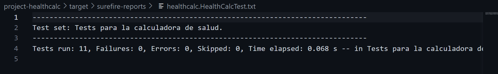

# isa2025-healthcalc
Health calculator used in Ingeniería del Software Avanzada

## Dependencies
--Java

---
Hay que hacer una clase HelathCalcInf
donde implementamos las clases al lado de la interfaz (codigo organizado) y los test se van a hacer en base a esas funciones


Funciones de github que vamos a usar :
```
git status
git add
git commit
git push
git merge
```


## Public float idealWeight funcion
**Entradas:** int height(cm) , char gender y puede lanzar una excepcion.

*Que lance una excepcion si no se han metido cm o gender que no sea 'm o v'* 

**Si el genero es hombre (M)**
>For men: IW = height - 100 - (height - 150) / 4)

**Si el genero es mujer (W)**
>For women: IW = height - 100 - (height - 150) / 25)

Esto devuelve el peso ideal (kg) no hace falta conversiones

## public float basalMetabolicRate
**entrada:** float weight, int height , int age , char gender y lanza un excepcion

*comprobar antes de nada que todos los parametros que se meten son del tipo que queremos*

**Si el genero es hombre (M)**
>For men: BMR = 88.362 + 13.397 * weight + 4.799 * height - 5.677 * age

**Si el genero es mujer (W)**
>For women: BMR = 447.593 + 9.247 * weight + 3.098 * height - 4.330 * age

Esto nos devuelve el BMR de la persona en kcal/day


# CASOS DE PRUEBA 

1. Comprobar si los parametros que se meten corresponden a los que se piden 
2. Comprobar que no sobrepasen los limites
3. comprobar que se hacen bien los calculos
4. Comprobar que se elige entre m o w correctamente y que salga excepcion si se pone otra cosa

## Casos de prueba funcion idealWeight
```
1. Correcta introduccion del genero que solo puede ser 'w' o 'm'.

2. Comprobar que la altura sea entre 140cm y 250cm

3. Comprobar si se calcula correctamente el peso ideal para mujeres

4. Comprobar si se calcula correctamente el peso ideal para hombres

```

## Casos de prueba funcion basalMetabolicRate
```
1. Correcta introduccion del genero que solo puede ser 'w' o 'm'.

2. Comprobar que la altura sea entre 140cm y 250cm

3. Comprobar que la edad introducida esta entre 5 y 100 para que sea valida

4. Comprobar que el peso introducir es valido y esta en el rango de 30kg y 300kg

5. Comprobar si se calcula correctamente el IBM para mujeres

6. Comprobar si se calcula correctamente el IBM para hombres
```

## .gitignore
En el .gitignore se puede observar que se ingnoran los archivos basicos para los proyectos en Java , se adjunta el archivo para facilitar el acceso.
 [.gitignore](./.gitignore).


# PRUEBAS TEST RESULTADOS


Al compilar todos los test mencionados en los casos de prueba se observa que todos funcionan correctamente.
